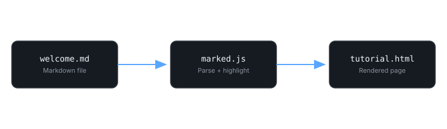

# Welcome to DocNest

DocNest is a small, dependency-light documentation engine. This page exists to show off
everything the renderer supports, so you can use it as a reference when writing your own
tutorials.

Every page you write is a plain `.md` file. DocNest handles the layout, the table of
contents, the syntax highlighting, and the reading time — you just write.

## Why another docs engine?

Most documentation tools ask you to learn a templating language, install a build
toolchain, or run a server. DocNest asks for none of that.

> The best documentation tool is the one that gets out of the way of the writing.
> If you can write a Markdown file, you can publish a page.

Here's what that looks like in practice:

- Drop a `.md` file into `tutorials/`
- Add one entry to `data/tutorials.json`
- Refresh the page

No compiler, no `node_modules`, no deploy pipeline required to preview your work locally.

## Anatomy of a tutorial

Every tutorial is made of a few common building blocks. This section walks through each one.

### Headings and structure

Use `##` for major sections and `###` for subsections. DocNest reads these headings to
build the table of contents on the right-hand side of the tutorial page automatically —
you never edit the TOC by hand.

### Images

Images are written the standard Markdown way and are automatically constrained to the
reading column width, with rounded corners and a subtle border to match the rest of the
interface.



### Tables

Tables are useful for comparing options at a glance.

| Feature          | Supported | Notes                          |
|-------------------|:---------:|---------------------------------|
| Headings           | Yes       | H1–H6, TOC built from H2/H3     |
| Tables             | Yes       | GitHub-flavored syntax          |
| Task lists         | Yes       | Rendered as checkboxes          |
| Syntax highlighting| Yes       | Powered by highlight.js         |
| Mermaid diagrams    | Planned   | See the roadmap                 |

### Code blocks

Code blocks get a language label, syntax highlighting, and a copy button in the top-right
corner. Here's a small Python example:

```python
def reading_time(text: str, words_per_minute: int = 200) -> int:
    """Estimate reading time in whole minutes, minimum of 1."""
    word_count = len(text.split())
    minutes = word_count / words_per_minute
    return max(1, round(minutes))
```

And the equivalent idea in JavaScript, which is what actually powers this site:

```javascript
export function calculateReadingTime(text, wordsPerMinute = 200) {
  const wordCount = text.trim().split(/\s+/).length;
  const minutes = wordCount / wordsPerMinute;
  return Math.max(1, Math.round(minutes));
}
```

When the same idea needs to be shown in a few languages, add the `tabs` keyword to the
fence. Consecutive `tabs` fences collapse into a single tabbed code block:

```python tabs
def reading_time(text: str, words_per_minute: int = 200) -> int:
    """Estimate reading time in whole minutes, minimum of 1."""
    word_count = len(text.split())
    minutes = word_count / words_per_minute
    return max(1, round(minutes))
```

```javascript tabs
export function calculateReadingTime(text, wordsPerMinute = 200) {
  const wordCount = text.trim().split(/\s+/).length;
  const minutes = wordCount / wordsPerMinute;
  return Math.max(1, Math.round(minutes));
}
```

### Lists

Ordered lists are handy for sequential steps:

1. Write your Markdown file
2. Save it inside `tutorials/`
3. Register it in `tutorials.json`
4. Link to it from another page, if useful

Unordered lists work for anything without an inherent order:

- Fast to write
- Easy to review in a pull request
- Portable to any static host

Task lists are useful for checklists inside a tutorial, like a setup guide:

- [x] Clone the repository
- [x] Open `index.html` with a static file server
- [ ] Write your first tutorial
- [ ] Deploy to your host of choice

### Inline code and links

Reference file names and short snippets with inline code, like `tutorials.json` or
`calculateReadingTime()`. Standard links work too — for example, the
[MDN Markdown guide](https://developer.mozilla.org/en-US/docs/MDN/Writing_guidelines/Writing_style_guide)
is a good general reference for Markdown conventions.

---

## What's next

Head back to the homepage and open the LangChain tutorial to see a longer, more technical
example, including a second code block written in a different language.
